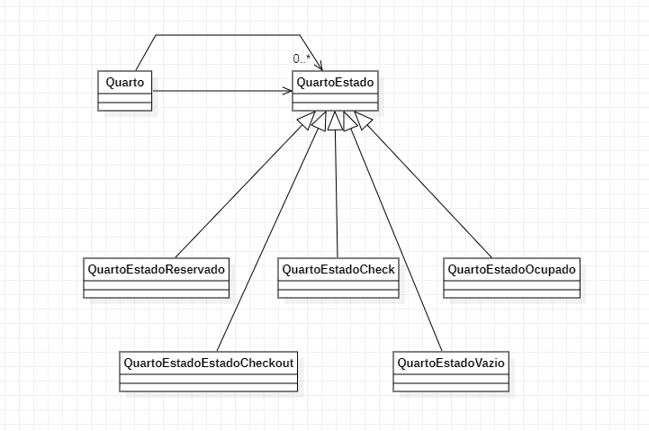

## 3. Padrões comportamentais:

---

### 3.6 Memento

### 3.6.1 Introdução

O Memento é um padrão de projeto comportamental que permite que você salve e restaure o estado anterior de um objeto sem revelar os detalhes de sua implementação.

### 3.6.2 Exemplo abordado
Para tal padrão de projeto, implementei um exemplo de reserva de hotel.

### 3.6.3 Diagrama de Classe do Exemplo

